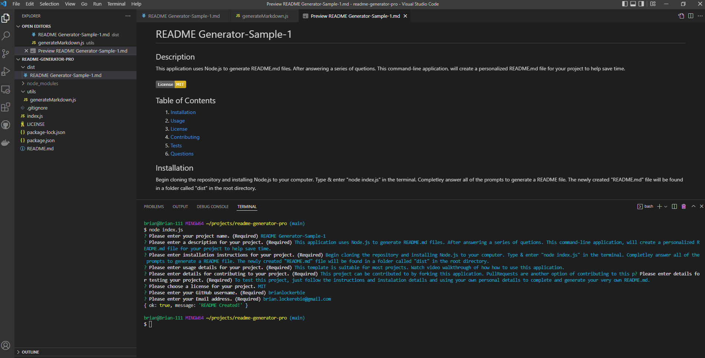

<h1 align="center">README Generator Pro  :battery: </h1> 

Module #9 - Node.js - Professional README Generator

## Description
  This application uses Node.js to generate README.md files. After answering a series of quetions. This command-line application, will create a personalized README.md file for your project to help save time.
   
   

## Built With:
  * JavaScript
  * Node.js
  * NPM
   

  

  ## Table of Contents
  
  1. [ Installation ](#installation)
  2. [ Usage ](#usage)
  3. [ License ](#license)
  4. [ Contributing ](#contributing)
  5. [ Tests ](#tests)
  6. [ Questions ](#questions)
  

  
  ## Installation
  Begin cloning the repository and installing Node.js to your computer. Type & enter "node index.js" in the terminal. Completley answer all of the prompts to generate a README file. The newly created "README.md" file will be found in a folder called "dist" in the root directory.

  

  ## Usage
  This template is suitable for most projects. Watch video walkthrough on how to use this application by clicking [here](https://drive.google.com/file/d/1va2k9S_tYl4pF4IdM8b-xpR6ujuWmn_B/view).

  
  

  ## License
  This project is licensed under the MIT License - see the [license info](https://opensource.org/licenses/MIT) for more details.
  

  

  ## Contributing
  You can contribute by Forking or by using Pull Requests.

  

  ## Tests
  You can test this app with almost any project.

  
  
  ## Questions

  [GitHub](https://github.com/brianlockerbie)
  For any questions, please send an Email to [brian.lockerebie@gmail.com](mailto:brian.lockerebie@gmail.com)

## User Story:
AS A developer
I WANT a README generator
SO THAT I can quickly create a professional README for a new project

## Acceptance Criteria:
GIVEN a command-line application that accepts user input
WHEN I am prompted for information about my application repository
THEN a high-quality, professional README.md is generated with the title of my project and sections entitled Description, Table of Contents, Installation, Usage, License, Contributing, Tests, and Questions
WHEN I enter my project title
THEN this is displayed as the title of the README
WHEN I enter a description, installation instructions, usage information, contribution guidelines, and test instructions
THEN this information is added to the sections of the README entitled Description, Installation, Usage, Contributing, and Tests
WHEN I choose a license for my application from a list of options
THEN a badge for that license is added near the top of the README and a notice is added to the section of the README entitled License that explains which license the application is covered under
WHEN I enter my GitHub username
THEN this is added to the section of the README entitled Questions, with a link to my GitHub profile
WHEN I enter my email address
THEN this is added to the section of the README entitled Questions, with instructions on how to reach me with additional questions
WHEN I click on the links in the Table of Contents
THEN I am taken to the corresponding section of the README

## Screenshot: 
